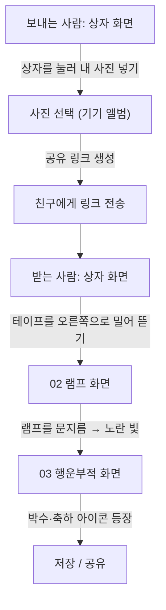

# 행운부적 (Lucky Box) — MVP 기획서

> 친구에게 **내 얼굴로 만든 행운부적**을 상자에 담아 선물하는 웹앱

---

## 1. 제품 개요

- **한 줄 소개**: 사용자가 자기 얼굴 사진을 넣어 "행운부적"을 만들고, 그것을 *행운 상자*에 담아 친구에게 보낸다. 친구는 상자를 열고 → 요술 램프를 문질러 → 행운부적을 받는다.
- **핵심 경험**: 상자 뜯기 → 램프 문지르기 → 부적 등장으로 이어지는 **선물 언박싱(unboxing)의 재미**.
- **플랫폼**: **웹 (모바일 웹 우선)**. 링크 하나로 공유하고 브라우저에서 바로 열린다.

---

## 2. 디자인 원칙

- 모든 화면 디자인은 **`image/design.pen` 파일에 있는 그대로** 구현한다. (임의 재디자인 금지)
- 사용 에셋: `image/box.png`, `image/lamp.png`, `image/main.png`, `image/네잎클로버.png`
- 배경은 흰색, 손그림 스티커 톤(두꺼운 검정 아웃라인 · 둥근 글씨체) 유지.
- 부적 안 사진은 **네잎클로버(초록 선 안쪽) 모양 그대로 클리핑**해서 넣는다. (design.pen의 부적 화면과 동일)

---

## 3. 사용자 역할

| 역할 | 설명 | 하는 일 |
| --- | --- | --- |
| **보내는 사람** | 부적을 만들어 선물하는 사람 | 상자를 눌러 자기 얼굴 사진을 넣고, 링크를 친구에게 보낸다 |
| **받는 사람** | 상자를 선물받은 친구 | 상자를 뜯고 → 램프를 문질러 → 완성된 행운부적을 확인한다 |

---

## 4. 전체 플로우

---

## 5. 화면별 플로우 & 인터랙션

### 화면 1 — 행운 상자 (`01 상자`)

**공통 화면.** 보내는 사람에게는 "사진 넣기", 받는 사람에게는 "상자 뜯기" 화면으로 동작한다.

#### (A) 보내는 사람 — 사진 넣기
- 흰 배경에 상자(`box.png`)만 있고, `눌러서 내 사진 넣기` 버튼(투명)이 있다.
- 상자 또는 버튼을 누르면 **기기 사진 앨범(파일 선택)** 이 열린다.
- 사진을 고르면 그 얼굴이 부적의 네잎클로버 안에 들어갈 이미지로 저장된다.
- 사진 선택 후 **공유 링크가 생성**되고, 친구에게 전송한다. (카카오톡/URL 복사 등)

#### (B) 받는 사람 — 상자 뜯기
- 링크로 들어오면 같은 상자 화면이 보인다.
- **상자를 여는 방법: 상자에 붙은 테이프를 오른쪽으로 밀면(드래그/스와이프) 테이프가 떼어지며 상자가 열린다.**
  - 테이프를 오른쪽 끝까지 밀면 뜯김 완료 → 자동으로 **화면 2(램프)** 로 전환.
  - 살짝만 밀면 원위치로 돌아온다. (끝까지 밀어야 열림)

---

### 화면 2 — 요술 램프 (`02 램프`)

- 흰 배경에 **`lamp.png` 만** 크게 있고, 위에 **"문질러봐!"** 문구가 있다.
- **인터랙션: 램프 위를 손가락으로 문지른다(문지르는 제스처 = 좌우로 여러 번 드래그).**
- 일정 횟수/시간 이상 문지르면:
  - **램프에서 노란색 빛이 퍼지는 애니메이션**이 나온다.
  - 노란 빛이 화면을 채우면서 **화면 3(행운부적)** 으로 전환된다.

> 문지르기 → 노란 빛 → 부적 등장의 연출이 이 화면의 핵심.

---

### 화면 3 — 행운부적 (`03 행운부적`)

- `main.png` 부적이 등장한다. 부적의 **네잎클로버 안에는 화면 1에서 넣은 얼굴 사진**이 클로버 모양 그대로 채워져 있다.
- **화면이 나타날 때 박수(👏) · 축하(🎉 등) 아이콘이 팡파레처럼 함께 등장**한다. (등장 애니메이션)
- 하단 버튼:
  - `저장하기` (투명 버튼) — 부적 이미지를 기기에 저장
  - `공유` (아이콘 버튼) — 부적을 다시 공유

---

## 6. 상태 전환 요약

| 현재 화면 | 트리거(인터랙션) | 다음 화면 |
| --- | --- | --- |
| 01 상자 (보내는 사람) | 상자 탭 → 사진 선택 → 링크 공유 | (친구에게 전달) |
| 01 상자 (받는 사람) | **테이프를 오른쪽으로 밀어 뜯기** | 02 램프 |
| 02 램프 | **램프 문지르기 → 노란 빛 발광** | 03 행운부적 |
| 03 행운부적 | (등장 시 **박수·축하 아이콘** 연출) | 저장 / 공유 |

---

## 7. MVP 범위

**포함**
- 3개 화면 (상자 / 램프 / 부적) — `design.pen` 디자인 그대로
- 사진 선택 및 네잎클로버 클리핑
- 공유 링크 생성 및 열람
- 인터랙션 3종: ① 테이프 오른쪽 슬라이드로 뜯기 ② 램프 문지르기 + 노란 빛 ③ 부적 등장 시 박수·축하 아이콘

**미포함 (추후)**
- 회원가입 / 로그인
- 부적 문구 커스터마이징
- 받은 부적 보관함, 알림
- 사운드 이펙트

---

## 8. 참고

- 디자인 원본: `image/design.pen` (Pencil)
- 화면 순서(캔버스): `01 상자` → `02 램프` → `03 행운부적`
